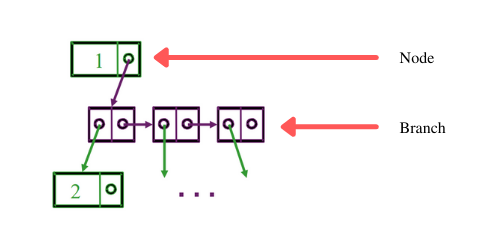
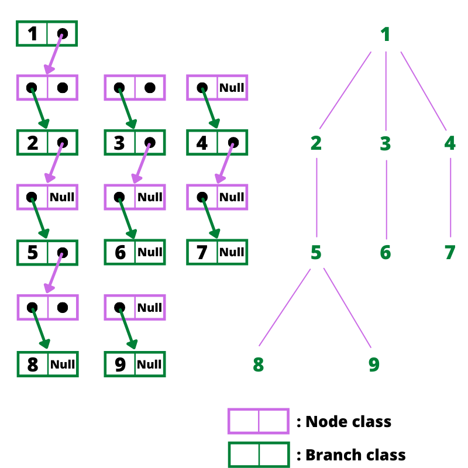

# Structure de Donnée Arbre (Abre binaire, ABR, AVL...)

Pour cette Structure de donnée, nous avons choisis la représentation des listes de sous-arbres par chaînage. 

De plus, nous allons considerer que nous stockerons des entier. Nous pouvons bien entudu étendre cette Structure de Donnée pour stocker des objets ou d'autre types de données.

Avant de commencer, nous allons vous rappeler rapidement le vocabulaire lié aux arbres : 

## Classe Tree :

La classe Tree est donc représentée par chainage. 

Elle contient un attribut qui correspond à la racine et à besoin deux deux autres classes pour fonctionner correctement : 
* **Node** qui correspond  à un noeud quelconque de l'arbre (noeud interne ou externe). Elle se compose d'une valeur (int) et d'une **Branch** 
* **Branch** qui correspond à une branche de l'arbre (lien entre deux noeud). Elle se compose d'un **Node** et d'une **Branche**.

Lorsqu'on met à la suite des **Node** et des **Branch**, on obtient un arbre. Le shéma ci-dessous vous aidera peut être à comprendre.

### Exemple de représentation d'arbre n-aire : 

#### Méthodes implémentées : 

* _addRoot_(Node n) : Permet d'ajouter un noeud au niveau de la racine (sert à initialiser un arbre vide)
* _addNode_(Entier father, Entier value, Node n) : Permet d'ajouter un noeud dans l'arbre en fonction de son père (Commence à charcher dans l'abre à partir du noeud n)
* _emptyTree_() : Retourne vrai si l'arbre est vide
* _copyNodeFromtree_(Node n) : Retourne la copie de n mais ses pointeurs (ainsi que ceux des Branch et Node qui en découlent) ont été changés 

Comme nous allons principalement travailler sur les arbres binaires, kd-arbres et quadtree, nous n'avons pas implémenté de méthode d'affichage pour les arbres n-aires.

## Classe Binary_Tree

Classe fille de Tree, elle est donc aussi représentée par le chainage décrit ci-dessus.

C'est cette sous classe là que nous allons réellement développer car il en découlera les classes des Arbres Binaires de recherche (ABR) et arbres équilibrés en hauteur (AVL).

