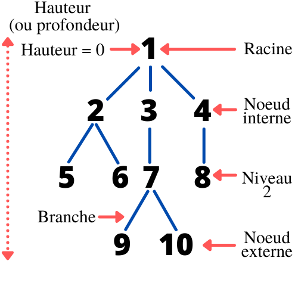
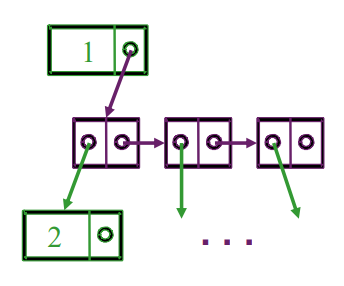

# Structure de Donnée Arbre (Abre binaire, ABR, AVL...)

Pour cette Structure de donnée, nous avons choisis la représentation des listes de sous-arbres par chaînage. 

De plus, nous allons considerer que nous stockerons des entier. Nous pouvons bien entudu étendre cette Structure de Donnée pour stocker des objets ou d'autre types de données.

Avant de commencer, nous allons vous rappeler rapidement le vocabulaire lié aux arbres : 

## Classe Tree :

la classe Tree est donc représentée par chainage. 

Elle contient un attribut qui est un pointeur vers la racine et à besoin deux deux autres classes pour fonctionner correctement : 
* **Node** qui correspond  à un noeud quelconque de l'arbre (noeud interne ou externe). Elle se compose d'une valeur (int) et d'une **Branch** 
* **Branch** qui correspond à une branche de l'arbre (lien entre deux noeud). Elle se compose d'un **Node** et d'une **Branche**.

Lorsqu'on met à la suite des **Node** et des **Branch**, on obtient un arbre. Le shéma ci-dessous vous aidera peut être à comprendre.

