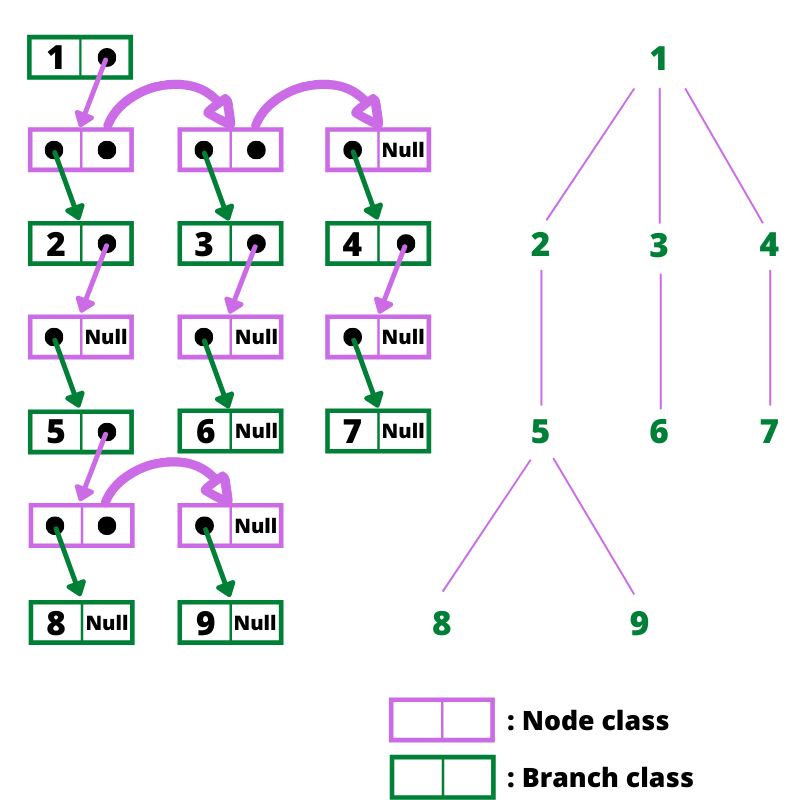

# Structure de Donnée Arbre (Abre binaire, ABR, AVL...)

Pour cette Structure de donnée, nous avons choisis la représentation des listes de sous-arbres par chaînage. 

De plus, nous allons considerer que nous stockerons des entier. Nous pouvons bien entudu étendre cette Structure de Donnée pour stocker des objets ou d'autre types de données.

Avant de commencer, nous allons vous rappeler rapidement le vocabulaire lié aux arbres : 


## Classe Tree :

La classe Tree est donc représentée par chainage. 

Elle contient un attribut qui correspond à la racine et à besoin deux deux autres classes pour fonctionner correctement : 
* **Node** qui correspond  à un noeud quelconque de l'arbre (noeud interne ou externe). Elle se compose d'une valeur (int) et d'une **Branch** 
* **Branch** qui correspond à une branche de l'arbre (lien entre deux noeud). Elle se compose d'un **Node** et d'une **Branche**.

Lorsqu'on met à la suite des **Node** et des **Branch**, on obtient un arbre. Le shéma ci-dessous vous aidera peut être à comprendre.


### Exemple de représentation d'arbre n-aire : 



Nous n'avons implémenté que deux méthodes :

_addRoot_ : Permet d'ajouter une valeur au niveau de la racine (sert à initialiser un arbre vide)
_addNode_ : Permet d'ajouter un noeud dans l'arbre en fonction de son père 

En effet, faire une fonction pour afficher l'arbre était trop chronophage et peu utile car nous n'utiliserons plus d'arbre n-aires par la suite.
Cependant nous avons fait un test dans le main en manipulant la fonction _addNode_ et le chainage directement pour s'assurer que notre classe était fonctionnelle.

```//Création de l'arbre vu dans l'exemple ci-dessus
Tree test = new Tree(1);
test.addNode(1, 2, test.root);
test.addNode(1, 3, test.root);
test.addNode(1, 4, test.root);
test.addNode(2, 5, test.root);
test.addNode(3, 6, test.root);
test.addNode(4, 7, test.root);
test.addNode(5, 8, test.root);
test.addNode(5, 9, test.root);

//Noeuds de hauteur 0 
System.out.println(test.root.value);

//Noeuds de hauteur 1
System.out.print(test.root.next.node.value);
System.out.print(" " + test.root.next.next.node.value);
System.out.println(" " + test.root.next.next.next.node.value);

//Noeuds de hauteur 2
System.out.print(test.root.next.node.next.node.value);
System.out.print(" " + test.root.next.next.node.next.node.value);
System.out.println(" " + test.root.next.next.next.node.next.node.value);

//Noeuds de hauteur 3
System.out.print(test.root.next.node.next.node.next.node.value);
System.out.print(" " + test.root.next.node.next.node.next.next.node.value);
```

## Classe Binary_Tree

Classe fille de Tree, elle est donc aussi représentée par le chainage décrit ci dessus.

C'est cette sous classe là que nous allons réelement developpée car il en découlera les classes des Arbres Binaires de recherche (ABR) et arbres équilibrés en hauteur (AVL).

